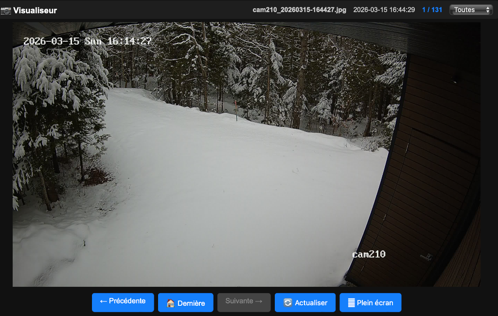

# ha-image-viewer

Visualiseur d'images pour Home Assistant, développé avec Python et Bottle.  
Conçu pour afficher les captures d'une caméra de surveillance stockées dans `/config/www/captures`.

Pour ceux et celles qui commencent dans le développement d'applications HA, j'ai documenté mon environnement de développement et le cycle d'entretien. Je suis débutant dans ce domaine particulier et j'ai tenté de garder ça simple.

## Historique

Dans mon instance Home Assistant, j'ai une caméra Hikvision de laquelle je capture des images losqu'il y a du mouvement et les conserve dans un répertoire. Voyant qu'il n'y avait pas de carte dans HA qui affiche des images à partir d'un répertoire, j'ai créé cette app qui utilise une interface web et qui affiche les images du répertoire en question.

## Aperçu


## Fonctionnalités

- Affichage de la dernière image au chargement
- Navigation entre les images (boutons, clavier)
- Tri automatique par date de modification (plus récente en premier)
- Support des formats : JPG, JPEG, PNG, GIF, BMP, WEBP
- Mode plein écran
- Sans cache (toujours l'image la plus récente)
- Compatible Home Assistant Ingress et accès direct par port
- API JSON `/api/images` pour lister les images
- Filtre pour sélectionner une caméra en particulier

## Architecture

```
ha-image-viewer/
├── Dockerfile
├── config.json
├── image-viewer.py
├── run.sh
├── deploy.sh
├── .gitignore
└── README.md
```

## Prérequis

- Home Assistant avec le superviseur (ex: HA OS ou HA Supervised)
- Architecture `aarch64` (Raspberry Pi 4/5)
- Images stockées dans `/config/www/captures`

## Installation dans Home Assistant

1. Copiez le répertoire dans `~/addons/dc_apps/image_viewer` sur votre instance HA
2. Dans HA : **Paramètres → Modules complémentaires → Boutique → ⋮ → Dépôts**
3. Ajoutez le chemin vers votre dépôt local
4. Installez et démarrez l'addon **Image Viewer**

## Configuration de la carte HA

Dans votre tableau de bord, ajoutez une carte avec ce YAML :

```yaml
type: panel
path: captures
title: Captures
cards:
  - type: iframe
    url: http://IP_DE_VOTRE_HA:8085
    aspect_ratio: 30%
```

## Flux de développement

Il est important de comprendre que cette procédure est liée à mon environnement de développement qui consiste en les éléments suivants:

1. J'utilise Cursor dans mon MacBook Pro comme éditeur et gestionnaire de code source, etc.
2. L'environnement de développement est une VM Debian dans mon MacBook
3. L'environnement de production est mon serveur Home Assistant dans un Raspberry Pi 4

```
Cursor (macOS) → VM Debian ~/devel/ha-image-viewer → GitHub → HA (deploy.sh)
```

### Première installation sur HA

1. Copiez les fichiers sources dans `~/addons/dc_apps/image_viewer` sur HA
2. Initialisez le repo git local sur HA :

```bash
cd ~/addons/dc_apps/image_viewer
git init
git remote add origin https://github.com/qcda1/ha-image-viewer.git
git pull origin main
chmod +x deploy.sh
```

1. Dans HA : **Paramètres → Apps → Installer l'application
2. Dans Magasin d'application, installer l'application Image Viewer qui devrait apparaître dans Local apps.

### Mises à jour suivantes

Après chaque `git push` depuis Cursor, déployez sur HA avec `deploy.sh` :

```bash
~/addons/dc_apps/image_viewer/deploy.sh
```

Le script effectue automatiquement `git pull` depuis GitHub puis redémarre l'addon.  
Pour puller sans redémarrer :

```bash
~/addons/dc_apps/image_viewer/deploy.sh --no-restart
```

### Modifier et déployer — cycle quotidien

1. Modifier les fichiers dans Cursor (connecté à la VM Debian via SSH Remote)
2. Commit + Push via l'interface Git de Cursor (ou `git push`)
3. Sur HA, exécuter `deploy.sh` :

```bash
~/addons/dc_apps/image_viewer/deploy.sh
```

## Utilisation

La capture des images se fait à l'aide d'une automatisation HA déclenchée par un mouvement par exemple. L'automatisation effectue une capture et enregistre l'image avec le préfix cam123 où 123 est un numéro représentant la caméra. Dans image-viewer, la liste des préfixes est disponible pour soit consulter toutes les captures peu importe la caméra ou consulter que les captures d'une caméra spécifiquement.

### Navigation clavier


| Touche | Action                           |
| ------ | -------------------------------- |
| ←      | Image précédente (plus ancienne) |
| →      | Image suivante (plus récente)    |
| Home   | Retour à la dernière image       |
| F5     | Actualiser                       |


### Filtre

Par défaut, toutes les images sont affichées selon la date/heure de la dernière modification peu importe le nom des fichiers. Si les fichiers de captures portent le nom commençant par camxxx où xxx est un numéro, l'utilisateur pourra spécifier la visualisation que pour la caméra choisi.

### API


| Endpoint             | Description                     |
| -------------------- | ------------------------------- |
| `GET /`              | Affiche la dernière image       |
| `GET /view/<index>`  | Affiche l'image à l'index donné |
| `GET /image/<index>` | Sert le fichier image brut      |
| `GET /api/images`    | Liste JSON de toutes les images |


## Dépendances Python

- [bottle](https://bottlepy.org/) — micro framework web
- [paste](https://pythonpaste.readthedocs.io/) — serveur WSGI performant

## Auteur

Daniel — [@qcda1](https://github.com/qcda1)
